# Graph RAG Architecture - Mermaid Diagrams

## Complete System Architecture

```mermaid
graph TB
    subgraph "User Layer"
        User[👤 User/Client]
    end

    subgraph "API Layer"
        APIGW[🌐 API Gateway<br/>REST API]
        UploadLambda[⚡ Lambda<br/>Upload Handler]
    end

    subgraph "Storage Layer"
        S3[🪣 S3 Bucket<br/>Documents & Staging]
    end

    subgraph "Event & Orchestration"
        EventBridge[📡 EventBridge<br/>Event Rules]
        StepFunctions[🔄 Step Functions<br/>State Machine]
        DLQ[📮 SQS DLQ<br/>Failed Events]
    end

    subgraph "Processing Layer - VPC"
        subgraph "Lambda Functions"
            DocParser[⚡ Lambda<br/>Document Parser]
            RDFGen[⚡ Lambda<br/>RDF Generator]
            OntologyVal[⚡ Lambda<br/>Ontology Validator<br/>🆕 NEW]
            NeptuneWriter[⚡ Lambda<br/>Neptune Writer]
            EmbedGen[⚡ Lambda<br/>Embedding Generator<br/>SageMaker]
            OSWriter[⚡ Lambda<br/>OpenSearch Writer]
        end
    end

    subgraph "ML Layer"
        SageMaker[🤖 SageMaker Endpoint<br/>Embedding Model<br/>Hugging Face]
    end

    subgraph "Data Stores - VPC"
        Neptune[🔵 Neptune Cluster<br/>Graph Database<br/>RDF/SPARQL]
        OpenSearch[🔍 OpenSearch Domain<br/>Vector Search<br/>k-NN]
    end

    subgraph "Ontology"
        OWL[📋 OWL Ontology<br/>graph-rag-ontology.ttl<br/>🆕 NEW]
    end

    subgraph "Networking"
        VPC[🏢 VPC<br/>10.0.0.0/16]
        PrivateSubnet[🔒 Private Subnets<br/>Neptune, OpenSearch, Lambda]
        PublicSubnet[🌍 Public Subnets<br/>NAT Gateway]
        SG[🛡️ Security Groups<br/>Neptune, OpenSearch, Lambda]
    end

    subgraph "Monitoring"
        CloudWatch[📊 CloudWatch<br/>Logs & Metrics]
        XRay[🔬 X-Ray<br/>Tracing]
    end

    %% User Flow
    User -->|1. Upload Document| APIGW
    APIGW -->|2. Invoke| UploadLambda
    UploadLambda -->|3. Store| S3
    
    %% Event Trigger
    S3 -.->|4. Object Created Event| EventBridge
    EventBridge -->|5. Trigger| StepFunctions
    EventBridge -.->|Failed| DLQ

    %% Processing Pipeline
    StepFunctions -->|6a. Parse| DocParser
    DocParser -->|7. Text & Chunks| RDFGen
    RDFGen -->|8. RDF Triples| OntologyVal
    OntologyVal -->|9. Validate| OWL
    
    %% Parallel Processing
    OntologyVal -->|10a. Valid RDF| NeptuneWriter
    OntologyVal -->|10b. Chunks| EmbedGen
    
    %% Neptune Path
    NeptuneWriter -->|11. Stage RDF| S3
    S3 -->|12. Bulk Load| Neptune
    
    %% Embedding Path
    EmbedGen -->|13. Generate| SageMaker
    SageMaker -->|14. Vectors| EmbedGen
    EmbedGen -->|15. Index| OSWriter
    OSWriter -->|16. Store| OpenSearch

    %% VPC Connections
    DocParser -.->|In| VPC
    RDFGen -.->|In| VPC
    OntologyVal -.->|In| VPC
    NeptuneWriter -.->|In| VPC
    EmbedGen -.->|In| VPC
    OSWriter -.->|In| VPC
    
    Neptune -.->|In| PrivateSubnet
    OpenSearch -.->|In| PrivateSubnet
    
    %% Monitoring
    StepFunctions -.->|Logs| CloudWatch
    DocParser -.->|Logs| CloudWatch
    RDFGen -.->|Logs| CloudWatch
    OntologyVal -.->|Logs| CloudWatch
    NeptuneWriter -.->|Logs| CloudWatch
    EmbedGen -.->|Logs| CloudWatch
    OSWriter -.->|Logs| CloudWatch
    StepFunctions -.->|Traces| XRay

    %% Styling
    classDef awsOrange fill:#FF9900,stroke:#232F3E,stroke-width:2px,color:#fff
    classDef awsBlue fill:#3B48CC,stroke:#232F3E,stroke-width:2px,color:#fff
    classDef awsGreen fill:#3F8624,stroke:#232F3E,stroke-width:2px,color:#fff
    classDef awsPurple fill:#8C4FFF,stroke:#232F3E,stroke-width:2px,color:#fff
    classDef awsRed fill:#D13212,stroke:#232F3E,stroke-width:2px,color:#fff
    classDef newFeature fill:#00D4AA,stroke:#232F3E,stroke-width:3px,color:#000

    class APIGW,S3 awsOrange
    class Neptune,OpenSearch awsBlue
    class UploadLambda,DocParser,RDFGen,NeptuneWriter,EmbedGen,OSWriter awsGreen
    class StepFunctions,EventBridge awsPurple
    class SageMaker awsRed
    class OntologyVal,OWL newFeature
```



## Upload Pipeline Detail


## Processing Pipeline (Step Functions)


## Data Flow with Ontology Validation

```mermaid
graph LR
    subgraph "Input"
        Doc[📄 Document<br/>PDF/DOCX/CSV]
    end

    subgraph "Processing"
        Parse[⚡ Parse<br/>Extract Text]
        RDF[⚡ Generate RDF<br/>Triples]
        Validate[⚡ Validate<br/>🆕 NEW]
        Onto[📋 OWL Ontology<br/>Classes & Rules]
    end

    subgraph "Validation Rules"
        R1[✓ Class Membership]
        R2[✓ Cardinality]
        R3[✓ Domain/Range]
        R4[✓ Required Props]
    end

    subgraph "Output Stores"
        Nep[🔵 Neptune<br/>Graph]
        OS[🔍 OpenSearch<br/>Vectors]
    end

    Doc --> Parse
    Parse --> RDF
    RDF --> Validate
    Validate --> Onto
    Onto --> R1
    Onto --> R2
    Onto --> R3
    Onto --> R4
    
    R1 --> Validate
    R2 --> Validate
    R3 --> Validate
    R4 --> Validate
    
    Validate -->|✅ Pass| Nep
    Validate -->|✅ Pass| OS
    Validate -->|❌ Fail| DLQ[📮 DLQ]

    style Validate fill:#00D4AA,stroke:#232F3E,stroke-width:3px
    style Onto fill:#00D4AA,stroke:#232F3E,stroke-width:3px
```



## VPC Architecture


## Neptune & OpenSearch Architecture


## Ontology Structure (OWL Classes)


## SageMaker Embedding Flow

```mermaid
graph LR
    subgraph "Text Processing"
        Chunks[📝 Text Chunks<br/>From Document]
    end

    subgraph "Lambda Function"
        EmbedLambda[⚡ Embedding Generator<br/>Lambda]
        
        Batch[Batch Chunks]
        Invoke[Invoke Endpoint]
        Collect[Collect Vectors]
    end

    subgraph "SageMaker"
        Endpoint[🤖 SageMaker Endpoint<br/>ml.m5.large]
        Model[🤗 Hugging Face Model<br/>all-mpnet-base-v2<br/>768 dimensions]
        
        Endpoint --> Model
    end

    subgraph "Vector Storage"
        Vectors[📊 Embeddings<br/>768-dim vectors]
    end

    Chunks --> EmbedLambda
    EmbedLambda --> Batch
    Batch --> Invoke
    Invoke -->|HTTP POST| Endpoint
    Model -->|JSON Response| Invoke
    Invoke --> Collect
    Collect --> Vectors

    style Model fill:#FF9900
    style Endpoint fill:#D13212
```



## Cost Breakdown


## Query Pipeline (Future)

```mermaid
graph TB
    subgraph "User Query"
        UserQ[👤 User Query<br/>"What are security policies?"]
    end

    subgraph "Query Processing"
        API2[🌐 API Gateway<br/>POST /query]
        QueryLambda[⚡ Query Lambda]
        EmbedQ[Generate Query<br/>Embedding]
    end

    subgraph "Retrieval"
        OSQuery[🔍 OpenSearch<br/>k-NN Search]
        NepQuery[🔵 Neptune<br/>Graph Traversal]
    end

    subgraph "ML Generation"
        SageMakerLLM[🤖 SageMaker<br/>LLM Endpoint]
        Context[📝 Enriched Context]
    end

    subgraph "Response"
        Answer[💬 Generated Answer<br/>with Citations]
    end

    UserQ --> API2
    API2 --> QueryLambda
    QueryLambda --> EmbedQ
    EmbedQ -->|Vector| OSQuery
    OSQuery -->|Top-k Chunks| Context
    QueryLambda -->|Document IDs| NepQuery
    NepQuery -->|Related Entities<br/>& Relationships| Context
    Context --> SageMakerLLM
    SageMakerLLM --> Answer
    Answer --> UserQ

    style QueryLambda fill:#00D4AA,stroke:#232F3E,stroke-width:2px
    style Context fill:#FFD93D,stroke:#232F3E,stroke-width:2px
```

## Legend

```mermaid
graph LR
    subgraph "AWS Services"
        API[🌐 API Gateway]
        Lambda[⚡ Lambda]
        S3[🪣 S3]
        EB[📡 EventBridge]
        SF[🔄 Step Functions]
        Nep[🔵 Neptune]
        OS[🔍 OpenSearch]
        SM[🤖 SageMaker]
        SQS[📮 SQS]
        CW[📊 CloudWatch]
    end

    subgraph "Features"
        New[🆕 NEW FEATURE<br/>Ontology Validation]
        Existing[Existing Feature]
    end

    subgraph "Data Flow"
        A -->|Synchronous| B
        C -.->|Asynchronous| D
    end

    style New fill:#00D4AA,stroke:#232F3E,stroke-width:3px
    style Existing fill:#FF9900,stroke:#232F3E,stroke-width:2px
```



## Deployment Stages


---

## How to Use These Diagrams

### In GitHub/GitLab
These Mermaid diagrams will render automatically in:
- README.md
- Wiki pages
- Issues/PRs

### In Documentation Sites
- **Docusaurus**: Supports Mermaid via plugin
- **MkDocs**: Use `mkdocs-mermaid2-plugin`
- **Sphinx**: Use `sphinxcontrib-mermaid`

### Export as Images
Use [Mermaid Live Editor](https://mermaid.live/):
1. Copy diagram code
2. Paste in editor
3. Export as PNG/SVG

### In VS Code
Install extension: `Markdown Preview Mermaid Support`

---

## Diagram Index

1. **Complete System Architecture** - Full end-to-end flow
2. **Upload Pipeline Detail** - Sequence diagram of upload
3. **Processing Pipeline** - State machine visualization
4. **Data Flow with Ontology** - Validation flow (🆕 NEW)
5. **VPC Architecture** - Network layout
6. **Neptune & OpenSearch** - Data store architecture
7. **Ontology Structure** - OWL class diagram (🆕 NEW)
8. **SageMaker Embedding** - ML pipeline
9. **Cost Breakdown** - Monthly costs
10. **Query Pipeline** - Future RAG retrieval
11. **Deployment Timeline** - Setup stages

