# Graph RAG Architecture - Mermaid Diagrams

## Complete System Architecture

## Upload Pipeline Detail

## Processing Pipeline (Step Functions)

## Data Flow with Ontology Validation

## VPC Architecture

## Neptune & OpenSearch Architecture

## Ontology Structure (OWL Classes)

```mermaid
classDiagram
    class Document {
        +hasId: string [1]
        +hasFileName: string [1]
        +hasTextLength: integer
        +createdAt: dateTime [1]
        +hasChunk() [1..*]
        +hasKeyword() [0..*]
        +hasAuthor() [0..1]
        +hasType() [0..*]
    }

    class TextChunk {
        +hasChunkId: integer [1]
        +hasText: string [1]
        +hasStartPosition: integer [1]
        +hasEndPosition: integer
        +hasLength: integer
        +partOf() [1]
        +mentions() [0..*]
        +hasEmbedding() [0..1]
    }

    class Entity {
        +hasValue: string [1]
        +hasConfidenceScore: decimal
        +relatedTo() [0..*]
        +coOccursWith() [0..*]
    }

    class Person {
        <<Entity>>
        +hasName: string
    }

    class Organization {
        <<Entity>>
    }

    class Keyword {
        +hasValue: string [1]
    }

    class Author {
        +hasName: string [1]
    }

    class Embedding {
        +hasVector: string [1]
        +hasDimensions: integer [1]
        +generatedBy: string [1]
    }

    class Policy {
        <<Document>>
    }

    class Standard {
        <<Document>>
    }

    Document "1" --> "1..*" TextChunk : hasChunk
    Document "1" --> "0..*" Keyword : hasKeyword
    Document "1" --> "0..1" Author : hasAuthor
    TextChunk "1" --> "0..*" Entity : mentions
    TextChunk "1" --> "0..1" Embedding : hasEmbedding
    Entity <--> Entity : coOccursWith
    Entity <--> Entity : relatedTo
    Person --|> Entity
    Organization --|> Entity
    Policy --|> Document
    Standard --|> Document

    note for Document "🆕 NEW: OWL Ontology\nCardinality: [min..max]\n[1] = exactly one\n[1..*] = one or more\n[0..*] = zero or more"
```

## SageMaker Embedding Flow

## Cost Breakdown

## Query Pipeline (Future)

## Legend

## Deployment Stages

---

## How to Use These Diagrams

### In GitHub/GitLab
These Mermaid diagrams will render automatically in:
- README.md
- Wiki pages
- Issues/PRs

### In Documentation Sites
- **Docusaurus**: Supports Mermaid via plugin
- **MkDocs**: Use `mkdocs-mermaid2-plugin`
- **Sphinx**: Use `sphinxcontrib-mermaid`

### Export as Images
Use [Mermaid Live Editor](https://mermaid.live/):
1. Copy diagram code
2. Paste in editor
3. Export as PNG/SVG

### In VS Code
Install extension: `Markdown Preview Mermaid Support`

---

## Diagram Index

1. **Complete System Architecture** - Full end-to-end flow
2. **Upload Pipeline Detail** - Sequence diagram of upload
3. **Processing Pipeline** - State machine visualization
4. **Data Flow with Ontology** - Validation flow (🆕 NEW)
5. **VPC Architecture** - Network layout
6. **Neptune & OpenSearch** - Data store architecture
7. **Ontology Structure** - OWL class diagram (🆕 NEW)
8. **SageMaker Embedding** - ML pipeline
9. **Cost Breakdown** - Monthly costs
10. **Query Pipeline** - Future RAG retrieval
11. **Deployment Timeline** - Setup stages

