# Graph RAG Architecture - Mermaid Diagrams

## Complete System Architecture

## Upload Pipeline Detail

## Processing Pipeline (Step Functions)

## Data Flow with Ontology Validation

## VPC Architecture

## Neptune & OpenSearch Architecture

## Ontology Structure (OWL Classes)

```mermaid
classDiagram
    class Document {
        +hasId: string [1]
        +hasFileName: string [1]
        +hasTextLength: integer
        +createdAt: dateTime [1]
        +hasChunk() [1..*]
        +hasKeyword() [0..*]
        +hasAuthor() [0..1]
        +hasType() [0..*]
    }

    class TextChunk {
        +hasChunkId: integer [1]
        +hasText: string [1]
        +hasStartPosition: integer [1]
        +hasEndPosition: integer
        +hasLength: integer
        +partOf() [1]
        +mentions() [0..*]
        +hasEmbedding() [0..1]
    }

    class Entity {
        +hasValue: string [1]
        +hasConfidenceScore: decimal
        +relatedTo() [0..*]
        +coOccursWith() [0..*]
    }

    class Person {
        <<Entity>>
        +hasName: string
    }

    class Organization {
        <<Entity>>
    }

    class Keyword {
        +hasValue: string [1]
    }

    class Author {
        +hasName: string [1]
    }

    class Embedding {
        +hasVector: string [1]
        +hasDimensions: integer [1]
        +generatedBy: string [1]
    }

    class Policy {
        <<Document>>
    }

    class Standard {
        <<Document>>
    }

    Document "1" --> "1..*" TextChunk : hasChunk
    Document "1" --> "0..*" Keyword : hasKeyword
    Document "1" --> "0..1" Author : hasAuthor
    TextChunk "1" --> "0..*" Entity : mentions
    TextChunk "1" --> "0..1" Embedding : hasEmbedding
    Entity <--> Entity : coOccursWith
    Entity <--> Entity : relatedTo
    Person --|> Entity
    Organization --|> Entity
    Policy --|> Document
    Standard --|> Document

    note for Document "🆕 NEW: OWL Ontology\nCardinality: [min..max]\n[1] = exactly one\n[1..*] = one or more\n[0..*] = zero or more"
```

## SageMaker Embedding Flow

## Cost Breakdown

### Monthly Cost Distribution (~$259/month)

| Service | Instance/Configuration | Cost/Month | Percentage | Use Case |
|---------|----------------------|------------|------------|----------|
| **SageMaker** | ml.m5.large (24/7) | $84 | 32% | Embedding generation |
| **Neptune** | db.t3.medium (Primary + Replica) | $70 | 27% | Graph database |
| **OpenSearch** | 2× t3.small.search nodes | $60 | 23% | Vector search + storage |
| **NAT Gateway** | 1 gateway in 1 AZ | $35 | 14% | Private subnet internet access |
| **Lambda & Other** | 6 functions + Step Functions + API Gateway | $10 | 4% | Processing & orchestration |
| **TOTAL** | | **$259** | **100%** | Complete system |

### Cost Optimization Options

**Quick Wins**:
- 💰 **Save $48/month**: Use ml.t3.medium for SageMaker (dev/testing)
- 💰 **Save $48-$74/month**: Use SageMaker Serverless for low volume (< 1000 docs/day)
- 💰 **Save $35/month**: Remove NAT Gateway (use VPC endpoints instead)
- 💰 **Save $28/month**: Use 1 OpenSearch node (non-HA)

**Long-term Savings**:
- 💰 **Save 20-64%**: SageMaker Savings Plans
- 💰 **Save 40-60%**: Neptune Reserved Instances
- 💰 **Save 30-45%**: OpenSearch Reserved Instances

### Alternative Pie Chart (Optional)

## Query Pipeline (Future)

---

## Advanced AI Agent Pipeline (Future²) 🚀

### Multi-Agent Architecture with Tree of Thoughts

```mermaid
graph TB
    User["User Complex Query"]
    Orchestrator["🧠 Agent Orchestrator"]
    
    subgraph "Tree of Thoughts Reasoning"
        ToT["Tree of Thoughts Engine"]
        Branch1["Branch 1: Direct Answer"]
        Branch2["Branch 2: Analytical"]
        Branch3["Branch 3: Creative"]
        Evaluate["Evaluate & Score Branches"]
        BestPath["Select Best Reasoning Path"]
    end
    
    subgraph "Specialized Agents"
        SearchAgent["🔍 Search Agent<br/>Vector + Graph Retrieval"]
        ReasonAgent["🤔 Reasoning Agent<br/>Logical Inference"]
        ValidationAgent["✓ Validation Agent<br/>Fact Checking"]
        SynthesisAgent["📝 Synthesis Agent<br/>Answer Generation"]
    end
    
    subgraph "Knowledge Base"
        Neptune2["Neptune<br/>Graph Knowledge"]
        OS2["OpenSearch<br/>Vector Search"]
        Memory["Agent Memory<br/>DynamoDB"]
    end
    
    LLM["🤖 Advanced LLM<br/>GPT-4/Claude/Bedrock"]
    FinalAnswer["Rich Answer + Reasoning Tree"]
    
    User --> Orchestrator
    Orchestrator --> ToT
    ToT --> Branch1
    ToT --> Branch2
    ToT --> Branch3
    Branch1 --> Evaluate
    Branch2 --> Evaluate
    Branch3 --> Evaluate
    Evaluate --> BestPath
    
    BestPath --> SearchAgent
    SearchAgent --> Neptune2
    SearchAgent --> OS2
    SearchAgent --> ReasonAgent
    
    ReasonAgent --> LLM
    ReasonAgent --> ValidationAgent
    ValidationAgent --> Neptune2
    ValidationAgent --> SynthesisAgent
    
    SynthesisAgent --> Memory
    SynthesisAgent --> LLM
    LLM --> FinalAnswer
    FinalAnswer --> User
    
    Orchestrator -.->|Track State| Memory
    
    style ToT fill:#FF6B9D,stroke:#232F3E,stroke-width:3px
    style Orchestrator fill:#00D4AA,stroke:#232F3E,stroke-width:3px
    style LLM fill:#9D4EDD,stroke:#232F3E,stroke-width:2px
    style FinalAnswer fill:#FFD93D,stroke:#232F3E,stroke-width:2px
```

### Tree of Thoughts Reasoning Flow

### Agent Collaboration Pattern

### Tree of Thoughts Expansion

```mermaid
graph TB
    Root["Root Query:<br/>Find security policies<br/>related to data protection"]
    
    subgraph "Depth 1: Initial Thoughts"
        T1["💭 Thought 1:<br/>Search by keywords"]
        T2["💭 Thought 2:<br/>Search by entities"]
        T3["💭 Thought 3:<br/>Search by relationships"]
    end
    
    subgraph "Depth 2: Expand Best Path"
        T2_1["Identify entities:<br/>GDPR, PII, encryption"]
        T2_2["Graph traversal:<br/>policy → compliance"]
        T2_3["Vector similarity:<br/>related concepts"]
    end
    
    subgraph "Depth 3: Validation"
        V1["✓ Check ontology"]
        V2["✓ Verify relationships"]
        V3["✓ Score confidence"]
    end
    
    subgraph "Pruning & Selection"
        Prune["🔪 Prune low-scoring<br/>branches (< 0.7)"]
        Select["⭐ Select best path<br/>(score: 0.94)"]
    end
    
    Result["Final Result:<br/>5 policies found<br/>with confidence scores"]
    
    Root --> T1
    Root --> T2
    Root --> T3
    
    T1 -.->|Score: 0.65| Prune
    T2 -->|Score: 0.89| T2_1
    T3 -.->|Score: 0.71| Prune
    
    T2_1 --> V1
    T2_2 --> V2
    T2_3 --> V3
    
    T2 --> T2_2
    T2 --> T2_3
    
    V1 --> Select
    V2 --> Select
    V3 --> Select
    
    Select --> Result
    
    style Root fill:#00D4AA,stroke:#232F3E,stroke-width:3px
    style T2 fill:#9D4EDD,stroke:#232F3E,stroke-width:2px
    style Select fill:#FFD93D,stroke:#232F3E,stroke-width:2px
    style Prune fill:#FF6B6B,stroke:#232F3E,stroke-width:2px
```

### Multi-Agent System Architecture

```mermaid
graph TB
    subgraph "Frontend Layer"
        UI["User Interface<br/>Chat + Reasoning Visualizer"]
        API3["API Gateway<br/>WebSocket + REST"]
    end
    
    subgraph "Agent Orchestration Layer"
        Orchestrator2["Agent Orchestrator<br/>Step Functions + Bedrock Agents"]
        ToTEngine["Tree of Thoughts Engine<br/>Lambda + SageMaker"]
        AgentMemory["Agent Memory Service<br/>DynamoDB + ElastiCache"]
    end
    
    subgraph "Specialized Agent Pool"
        direction LR
        Agent1["🔍 Search Agent"]
        Agent2["🤔 Reasoning Agent"]
        Agent3["✓ Validation Agent"]
        Agent4["📝 Synthesis Agent"]
        Agent5["🔬 Analysis Agent"]
        Agent6["🎨 Creative Agent"]
    end
    
    subgraph "Knowledge & Data Layer"
        Neptune3["Neptune<br/>Graph + Ontology"]
        OS3["OpenSearch<br/>Vectors + Full-text"]
        S3_2["S3<br/>Documents + Artifacts"]
        External["External APIs<br/>Weather, News, etc."]
    end
    
    subgraph "AI/ML Layer"
        Bedrock["AWS Bedrock<br/>Claude/Llama"]
        SageMaker2["SageMaker<br/>Custom Models"]
        StepFunctions2["Step Functions<br/>Workflow Orchestration"]
    end
    
    UI --> API3
    API3 --> Orchestrator2
    Orchestrator2 --> ToTEngine
    Orchestrator2 --> AgentMemory
    
    ToTEngine --> Agent1
    ToTEngine --> Agent2
    ToTEngine --> Agent3
    ToTEngine --> Agent4
    ToTEngine --> Agent5
    ToTEngine --> Agent6
    
    Agent1 --> Neptune3
    Agent1 --> OS3
    Agent2 --> Bedrock
    Agent3 --> Neptune3
    Agent4 --> SageMaker2
    Agent5 --> S3_2
    Agent6 --> External
    
    Orchestrator2 --> StepFunctions2
    StepFunctions2 --> Bedrock
    
    style Orchestrator2 fill:#00D4AA,stroke:#232F3E,stroke-width:3px
    style ToTEngine fill:#FF6B9D,stroke:#232F3E,stroke-width:3px
    style Bedrock fill:#9D4EDD,stroke:#232F3E,stroke-width:2px
```

### Cost Estimation (Future² Architecture)

**Additional Components**:

| Component | Configuration | Monthly Cost | Notes |
|-----------|--------------|--------------|-------|
| **AWS Bedrock** | Claude 3.5 Sonnet | $50-200 | Based on token usage (10K-40K requests) |
| **DynamoDB** | Agent Memory (On-demand) | $10-25 | State storage + conversation history |
| **ElastiCache** | Redis t3.small | $15 | Agent state caching |
| **Additional Lambda** | 4 agent functions | $5-10 | Specialized agent logic |
| **Step Functions** | Agent orchestration | $5-15 | Complex workflows |
| **CloudWatch** | Enhanced monitoring | $5-10 | Agent metrics + traces |
| **X-Ray** | Distributed tracing | $3-5 | Agent interaction tracing |
| **TOTAL (Additional)** | | **$93-280** | On top of existing $259 |
| **GRAND TOTAL** | | **$352-539** | Complete agentic system |

**Cost Optimization**:
- 💡 Use Bedrock On-Demand vs Provisioned Throughput
- 💡 Cache agent responses in ElastiCache
- 💡 Implement agent result memoization
- 💡 Use Step Functions Express for high-volume workflows

---

## Legend

## Deployment Stages

---

## How to Use These Diagrams

### In GitHub/GitLab
These Mermaid diagrams will render automatically in:
- README.md
- Wiki pages
- Issues/PRs

### In Documentation Sites
- **Docusaurus**: Supports Mermaid via plugin
- **MkDocs**: Use `mkdocs-mermaid2-plugin`
- **Sphinx**: Use `sphinxcontrib-mermaid`

### Export as Images
Use [Mermaid Live Editor](https://mermaid.live/):
1. Copy diagram code
2. Paste in editor
3. Export as PNG/SVG

### In VS Code
Install extension: `Markdown Preview Mermaid Support`

---

## Diagram Index

### Current Implementation
1. **Complete System Architecture** - Full end-to-end flow
2. **Upload Pipeline Detail** - Sequence diagram of upload
3. **Processing Pipeline** - State machine visualization
4. **Data Flow with Ontology** - Validation flow (🆕 NEW)
5. **VPC Architecture** - Network layout
6. **Neptune & OpenSearch** - Data store architecture
7. **Ontology Structure** - OWL class diagram (🆕 NEW)
8. **SageMaker Embedding** - ML pipeline
9. **Cost Breakdown** - Monthly costs with optimization tips

### Future Roadmap
10. **Query Pipeline (Future)** - Basic RAG retrieval with LLM

### Advanced Future (Future²) 🚀
11. **Multi-Agent Architecture** - Tree of Thoughts with specialized agents
12. **Tree of Thoughts Reasoning Flow** - Sequence diagram of agent reasoning
13. **Agent Collaboration Pattern** - Observe-Think-Plan-Act-Reflect loop
14. **Tree of Thoughts Expansion** - Branch generation and pruning
15. **Multi-Agent System Architecture** - Complete agentic system with AWS Bedrock
16. **Future² Cost Estimation** - Additional components and optimization

### Deployment & Reference
17. **Deployment Timeline** - Setup stages
18. **Legend** - Diagram symbols and conventions

