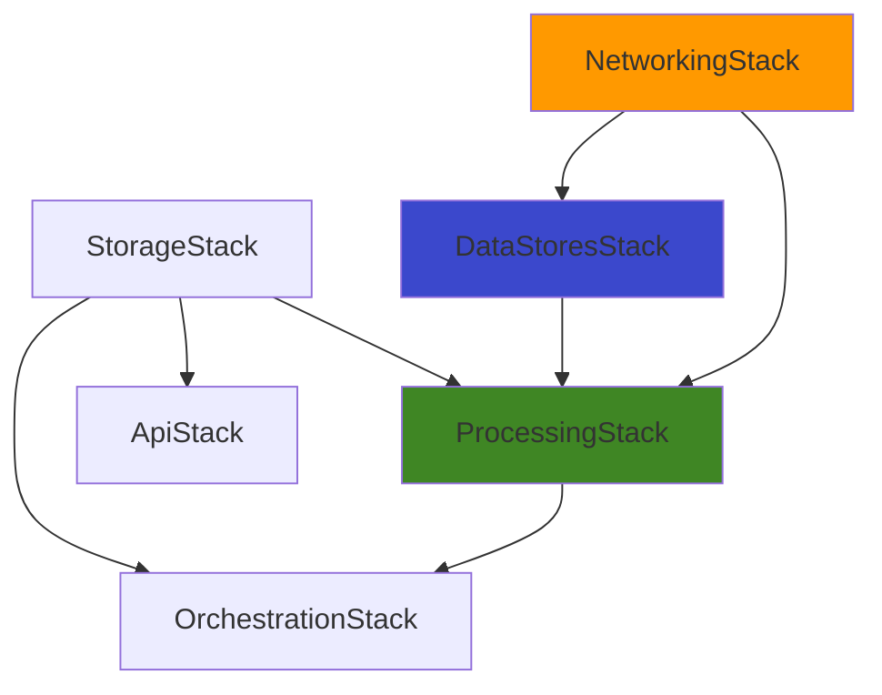

# Infrastructure as Code (IAC) Guide - AWS CDK

## Overview

This document provides comprehensive documentation for the **Infrastructure as Code (IAC)** implementation of the Graph RAG system using AWS CDK with TypeScript.

## Table of Contents

1. [CDK Stack Architecture](#cdk-stack-architecture)
2. [Resource Inventory](#resource-inventory)
3. [Stack Dependencies](#stack-dependencies)
4. [IAM Roles and Permissions](#iam-roles-and-permissions)
5. [Network Architecture](#network-architecture)
6. [Resource Naming Conventions](#resource-naming-conventions)
7. [Configuration Management](#configuration-management)
8. [Deployment Procedures](#deployment-procedures)
9. [Infrastructure Updates](#infrastructure-updates)
10. [Cost Optimization](#cost-optimization)
11. [Troubleshooting](#troubleshooting)

---

## CDK Stack Architecture

### Stack Organization

The infrastructure is organized into **6 independent CDK stacks** with clear separation of concerns:

```
graph-rag-cdk
│
├── NetworkingStack         (Foundation)
├── StorageStack            (Independent)
├── DataStoresStack         (Depends on: NetworkingStack)
├── ProcessingStack         (Depends on: NetworkingStack, StorageStack, DataStoresStack)
├── OrchestrationStack      (Depends on: StorageStack, ProcessingStack)
└── ApiStack                (Depends on: StorageStack)
```

### 1. NetworkingStack

**File**: `lib/networking-stack.ts`

**Purpose**: Foundation networking infrastructure for VPC-based resources

**Resources Created:**
- **VPC** (`ec2.Vpc`)
  - CIDR: 10.0.0.0/16
  - 2 Availability Zones
  - Public subnets (2× /24)
  - Private subnets with egress (2× /24)
  - Isolated subnets (2× /28)
  - NAT Gateways: 1 (configurable)
  - Internet Gateway: 1

- **Security Groups** (3):
  - Neptune Security Group (port 8182)
  - OpenSearch Security Group (port 443)
  - Lambda Security Group (all outbound)

**Outputs:**
```typescript
VpcId
PrivateSubnetIds
NeptuneSecurityGroupId
OpenSearchSecurityGroupId
```

**Cost Impact**: ~$35/month (NAT Gateway)

**CDK Code Structure:**
```typescript
export class NetworkingStack extends cdk.Stack {
  public readonly vpc: ec2.Vpc;
  public readonly neptuneSecurityGroup: ec2.SecurityGroup;
  public readonly openSearchSecurityGroup: ec2.SecurityGroup;
  public readonly lambdaSecurityGroup: ec2.SecurityGroup;

  constructor(scope: Construct, id: string, props?: cdk.StackProps) {
    // VPC creation
    this.vpc = new ec2.Vpc(this, 'GraphRagVpc', {
      ipAddresses: ec2.IpAddresses.cidr('10.0.0.0/16'),
      maxAzs: 2,
      natGateways: 1,
    });

    // Security groups
    this.neptuneSecurityGroup = new ec2.SecurityGroup(this, 'NeptuneSG', {...});
    // ... security group rules
  }
}
```

### 2. StorageStack

**File**: `lib/storage-stack.ts`

**Purpose**: S3 bucket for document storage and processing staging

**Resources Created:**
- **S3 Bucket** (`s3.Bucket`)
  - Versioning: Enabled
  - Encryption: SSE-S3
  - Public access: Blocked
  - EventBridge: Enabled
  - CORS: Configured for uploads
  - Lifecycle policies:
    - Old versions → Glacier (30 days)
    - Delete old versions (90 days)

**Outputs:**
```typescript
DocumentBucketName
DocumentBucketArn
```

**Cost Impact**: ~$3-5/month (100GB storage)

**CDK Code Structure:**
```typescript
export class StorageStack extends cdk.Stack {
  public readonly documentBucket: s3.Bucket;

  constructor(scope: Construct, id: string, props?: cdk.StackProps) {
    this.documentBucket = new s3.Bucket(this, 'DocumentBucket', {
      versioned: true,
      encryption: s3.BucketEncryption.S3_MANAGED,
      eventBridgeEnabled: true,
      lifecycleRules: [
        {
          noncurrentVersionTransitions: [{
            storageClass: s3.StorageClass.GLACIER,
            transitionAfter: cdk.Duration.days(30),
          }],
        },
      ],
    });
  }
}
```

### 3. DataStoresStack

**File**: `lib/datastores-stack.ts`

**Purpose**: Graph database (Neptune) and vector search (OpenSearch)

**Resources Created:**

- **Neptune Cluster**:
  - DB Subnet Group (`neptune.CfnDBSubnetGroup`)
  - Cluster Parameter Group (`neptune.CfnDBClusterParameterGroup`)
  - DB Cluster (`neptune.CfnDBCluster`)
  - DB Instance - Primary (`neptune.CfnDBInstance`)
  - Instance Parameter Group (`neptune.CfnDBParameterGroup`)

- **OpenSearch Domain** (`opensearch.Domain`):
  - Version: OpenSearch 2.11
  - 2 data nodes (t3.small.search)
  - EBS storage (50GB gp3 per node)
  - Zone awareness (2 AZs)
  - k-NN plugin enabled

**Outputs:**
```typescript
NeptuneClusterEndpoint
NeptuneClusterReadEndpoint
NeptuneClusterPort
OpenSearchDomainEndpoint
OpenSearchDomainArn
OpenSearchDashboardsUrl
```

**Cost Impact**: ~$130/month (Neptune $70 + OpenSearch $60)

**CDK Code Structure:**
```typescript
export interface DataStoresStackProps extends cdk.StackProps {
  vpc: ec2.Vpc;
  neptuneSecurityGroup: ec2.SecurityGroup;
  openSearchSecurityGroup: ec2.SecurityGroup;
}

export class DataStoresStack extends cdk.Stack {
  public readonly neptuneCluster: neptune.CfnDBCluster;
  public readonly openSearchDomain: opensearch.Domain;

  constructor(scope: Construct, id: string, props: DataStoresStackProps) {
    // Neptune cluster
    this.neptuneCluster = new neptune.CfnDBCluster(this, 'NeptuneCluster', {
      dbClusterIdentifier: 'graph-rag-neptune-cluster',
      storageEncrypted: true,
      iamAuthEnabled: true,
      engineVersion: '1.3.1.0',
    });

    // OpenSearch domain
    this.openSearchDomain = new opensearch.Domain(this, 'OpenSearchDomain', {
      version: opensearch.EngineVersion.OPENSEARCH_2_11,
      capacity: { dataNodes: 2, dataNodeInstanceType: 't3.small.search' },
      vpc: props.vpc,
    });
  }
}
```

### 4. ProcessingStack

**File**: `lib/processing-stack.ts`

**Purpose**: Lambda functions for document processing pipeline

**Resources Created:**

**5 Lambda Functions**:

1. **Document Parser** (`lambda.Function`)
   - Runtime: Python 3.12, ARM64
   - Memory: 1024 MB
   - Timeout: 5 minutes
   - VPC: Private subnets

2. **RDF Generator** (`lambda.Function`)
   - Runtime: Python 3.12, ARM64
   - Memory: 2048 MB
   - Timeout: 10 minutes
   - VPC: Private subnets

3. **Neptune Writer** (`lambda.Function`)
   - Runtime: Python 3.12, ARM64
   - Memory: 512 MB
   - Timeout: 15 minutes
   - VPC: Private subnets
   - Additional IAM: neptune-db:* permissions

4. **Embedding Generator** (`lambda.Function`)
   - Runtime: Python 3.12, ARM64
   - Memory: 512 MB
   - Timeout: 5 minutes
   - VPC: Private subnets
   - Additional IAM: sagemaker:InvokeEndpoint

5. **OpenSearch Writer** (`lambda.Function`)
   - Runtime: Python 3.12, ARM64
   - Memory: 512 MB
   - Timeout: 5 minutes
   - VPC: Private subnets
   - Additional IAM: es:ESHttp* permissions

**Additional Resources**:
- Neptune Bulk Load IAM Role
- Lambda execution roles (auto-created)
- CloudWatch Log Groups (auto-created)

**Outputs:**
```typescript
DocumentParserFunctionArn
RdfGeneratorFunctionArn
NeptuneWriterFunctionArn
EmbeddingGeneratorFunctionArn
OpenSearchWriterFunctionArn
```

**Cost Impact**: ~$5-10/month (pay-per-invocation)

**CDK Code Structure:**
```typescript
export interface ProcessingStackProps extends cdk.StackProps {
  vpc: ec2.Vpc;
  documentBucket: s3.Bucket;
  neptuneCluster: neptune.CfnDBCluster;
  openSearchDomain: opensearch.Domain;
  lambdaSecurityGroup: ec2.SecurityGroup;
}

export class ProcessingStack extends cdk.Stack {
  public readonly documentParserFunction: lambda.Function;
  // ... other functions

  constructor(scope: Construct, id: string, props: ProcessingStackProps) {
    // Common environment
    const commonEnvironment = {
      DOCUMENT_BUCKET_NAME: props.documentBucket.bucketName,
      NEPTUNE_ENDPOINT: props.neptuneCluster.attrEndpoint,
      OPENSEARCH_ENDPOINT: `https://${props.openSearchDomain.domainEndpoint}`,
    };

    // Create Lambda functions
    this.documentParserFunction = new lambda.Function(this, 'DocParser', {
      runtime: lambda.Runtime.PYTHON_3_12,
      code: lambda.Code.fromAsset('lambda/document-parser'),
      vpc: props.vpc,
      environment: commonEnvironment,
    });

    // Grant permissions
    props.documentBucket.grantRead(this.documentParserFunction);
  }
}
```

### 5. OrchestrationStack

**File**: `lib/orchestration-stack.ts`

**Purpose**: Event-driven workflow orchestration

**Resources Created:**

- **Step Functions State Machine** (`sfn.StateMachine`)
  - Type: Standard workflow
  - Timeout: 30 minutes
  - X-Ray tracing: Enabled
  - CloudWatch logging: ALL level
  - States:
    - Parse Document (Lambda invoke)
    - Generate RDF (Lambda invoke)
    - Parallel State:
      - Branch A: Neptune Write
      - Branch B: Embedding → OpenSearch
    - Success/Fail states

- **EventBridge Rule** (`events.Rule`)
  - Event source: aws.s3
  - Event type: Object Created
  - Target: Step Functions

- **SQS Dead Letter Queue** (`sqs.Queue`)
  - Retention: 14 days
  - Purpose: Failed event capture

- **CloudWatch Log Group** (`logs.LogGroup`)
  - Retention: 1 week
  - Purpose: State machine execution logs

**Outputs:**
```typescript
StateMachineArn
StateMachineConsoleUrl
EventRuleName
DlqUrl
```

**Cost Impact**: ~$1-2/month (pay-per-execution)

**CDK Code Structure:**
```typescript
export interface OrchestrationStackProps extends cdk.StackProps {
  documentBucket: s3.Bucket;
  documentParserFunction: lambda.Function;
  // ... other functions
}

export class OrchestrationStack extends cdk.Stack {
  public readonly stateMachine: sfn.StateMachine;

  constructor(scope: Construct, id: string, props: OrchestrationStackProps) {
    // Define workflow
    const parseTask = new tasks.LambdaInvoke(this, 'Parse', {
      lambdaFunction: props.documentParserFunction,
    });

    const parallelState = new sfn.Parallel(this, 'Parallel');
    parallelState.branch(rdfBranch);
    parallelState.branch(embeddingBranch);

    const definition = parseTask.next(parallelState);

    // Create state machine
    this.stateMachine = new sfn.StateMachine(this, 'StateMachine', {
      definitionBody: sfn.DefinitionBody.fromChainable(definition),
      tracingEnabled: true,
    });

    // EventBridge rule
    const rule = new events.Rule(this, 'S3UploadRule', {
      eventPattern: {
        source: ['aws.s3'],
        detailType: ['Object Created'],
      },
    });

    rule.addTarget(new targets.SfnStateMachine(this.stateMachine));
  }
}
```

### 6. ApiStack

**File**: `lib/api-stack.ts`

**Purpose**: HTTP API for document uploads

**Resources Created:**

- **API Gateway REST API** (`apigateway.RestApi`)
  - Stage: prod
  - Logging: INFO level
  - Throttling: 50 req/sec, 100 burst
  - CORS: Enabled

- **Upload Handler Lambda** (`lambda.Function`)
  - Runtime: Python 3.12, ARM64
  - Memory: 512 MB
  - Timeout: 30 seconds

- **API Resources & Methods**:
  - `POST /upload` - Direct file upload
  - `GET /presigned-url` - Presigned URL generation

- **Request Validator** (`apigateway.RequestValidator`)
- **Request Model** (`apigateway.Model`)

**Outputs:**
```typescript
ApiEndpoint
UploadEndpoint
PresignedUrlEndpoint
ApiId
ExampleCurlCommand
```

**Cost Impact**: ~$0.50/month (1000 requests)

**CDK Code Structure:**
```typescript
export interface ApiStackProps extends cdk.StackProps {
  documentBucket: s3.Bucket;
}

export class ApiStack extends cdk.Stack {
  public readonly api: apigateway.RestApi;

  constructor(scope: Construct, id: string, props: ApiStackProps) {
    this.api = new apigateway.RestApi(this, 'Api', {
      deployOptions: {
        stageName: 'prod',
        throttlingRateLimit: 50,
      },
      defaultCorsPreflightOptions: {
        allowOrigins: apigateway.Cors.ALL_ORIGINS,
      },
    });

    // Upload endpoint
    const uploadResource = this.api.root.addResource('upload');
    uploadResource.addMethod('POST', integration);
  }
}
```

---

## Resource Inventory

### Complete AWS Resources Provisioned

| Category | Resource Type | Resource Name | Count | Cost/Month |
|----------|---------------|---------------|-------|------------|
| **Compute** | Lambda Functions | graph-rag-* | 6 | ~$5-10 |
| **Networking** | VPC | graph-rag-vpc | 1 | $0 |
| | Subnets | Public/Private | 6 | $0 |
| | NAT Gateway | - | 1-2 | $35-70 |
| | Internet Gateway | - | 1 | $0 |
| | Security Groups | Neptune/OpenSearch/Lambda | 3 | $0 |
| **Storage** | S3 Bucket | Document storage | 1 | $3-5 |
| **Database** | Neptune Cluster | graph-rag-neptune-cluster | 1 | $70 |
| | Neptune Instance | Primary | 1 | - |
| | OpenSearch Domain | graph-rag-opensearch | 1 | $60 |
| | OpenSearch Nodes | Data nodes | 2 | - |
| **Orchestration** | Step Functions | graph-rag-processing | 1 | $1-2 |
| | EventBridge Rule | S3 upload trigger | 1 | $0 |
| | SQS Queue | DLQ | 1 | $0 |
| **API** | API Gateway | Graph RAG API | 1 | $0.50 |
| **ML** | SageMaker Endpoint | Embedding model | 1 | $84 |
| **Monitoring** | CloudWatch Log Groups | Various | 8 | $1-2 |
| **TOTAL** | | | | **~$259-269/month** |

### Resource ARN Patterns

```
VPC:
  arn:aws:ec2:region:account:vpc/vpc-xxxxx

S3 Bucket:
  arn:aws:s3:::graphragstoragestack-documentbucketxxxxx

Neptune Cluster:
  arn:aws:neptune:region:account:cluster:graph-rag-neptune-cluster

OpenSearch Domain:
  arn:aws:es:region:account:domain/graph-rag-opensearch

Lambda Functions:
  arn:aws:lambda:region:account:function:graph-rag-{function-name}

Step Functions:
  arn:aws:states:region:account:stateMachine:graph-rag-processing

API Gateway:
  arn:aws:apigateway:region::/restapis/xxxxx
```

---

## Stack Dependencies

### Dependency Graph



### Deployment Order

**Enforced by CDK:**

```typescript
// In bin/graph-rag-cdk.ts

// Create stacks
const networkingStack = new NetworkingStack(app, 'NetworkingStack');
const storageStack = new StorageStack(app, 'StorageStack');
const dataStoresStack = new DataStoresStack(app, 'DataStoresStack', {
  vpc: networkingStack.vpc,  // Dependency
});

// Add explicit dependencies
storageStack.addDependency(networkingStack);
dataStoresStack.addDependency(networkingStack);
processingStack.addDependency(dataStoresStack);
processingStack.addDependency(storageStack);
orchestrationStack.addDependency(processingStack);
apiStack.addDependency(storageStack);
```

**Deployment sequence:**
1. NetworkingStack
2. StorageStack (parallel with #1)
3. DataStoresStack (waits for #1)
4. ProcessingStack (waits for #2, #3)
5. OrchestrationStack (waits for #4)
6. ApiStack (waits for #2)

---

## IAM Roles and Permissions

### Auto-Created Execution Roles

#### Lambda Execution Roles

Each Lambda function gets an execution role with:

**Base permissions** (all functions):
```json
{
  "Effect": "Allow",
  "Action": [
    "logs:CreateLogGroup",
    "logs:CreateLogStream",
    "logs:PutLogEvents"
  ],
  "Resource": "arn:aws:logs:*:*:*"
}
```

**VPC permissions** (VPC Lambda functions):
```json
{
  "Effect": "Allow",
  "Action": [
    "ec2:CreateNetworkInterface",
    "ec2:DescribeNetworkInterfaces",
    "ec2:DeleteNetworkInterface"
  ],
  "Resource": "*"
}
```

#### Function-Specific Permissions

**Document Parser**:
```typescript
documentBucket.grantRead(documentParserFunction);
// Grants: s3:GetObject, s3:ListBucket
```

**RDF Generator**:
```typescript
documentBucket.grantReadWrite(rdfGeneratorFunction);
// Grants: s3:GetObject, s3:PutObject
```

**Neptune Writer**:
```typescript
neptuneWriterFunction.addToRolePolicy(new iam.PolicyStatement({
  actions: [
    'neptune-db:connect',
    'neptune-db:ReadDataViaQuery',
    'neptune-db:WriteDataViaQuery',
  ],
  resources: [neptuneClusterResourceArn],
}));
```

**Embedding Generator**:
```typescript
embeddingGeneratorFunction.addToRolePolicy(new iam.PolicyStatement({
  actions: ['sagemaker:InvokeEndpoint'],
  resources: [`arn:aws:sagemaker:${region}:${account}:endpoint/*`],
}));
```

**OpenSearch Writer**:
```typescript
openSearchWriterFunction.addToRolePolicy(new iam.PolicyStatement({
  actions: ['es:ESHttpPost', 'es:ESHttpPut', 'es:ESHttpGet'],
  resources: [`${openSearchDomain.domainArn}/*`],
}));
```

#### Neptune Bulk Load Role

**Created explicitly**:
```typescript
const neptuneBulkLoadRole = new iam.Role(this, 'NeptuneBulkLoadRole', {
  assumedBy: new iam.ServicePrincipal('rds.amazonaws.com'),
});

documentBucket.grantRead(neptuneBulkLoadRole, 'neptune-staging/*');
```

**Trust Policy**:
```json
{
  "Version": "2012-10-17",
  "Statement": [{
    "Effect": "Allow",
    "Principal": { "Service": "rds.amazonaws.com" },
    "Action": "sts:AssumeRole"
  }]
}
```

#### Step Functions Execution Role

**Auto-created with**:
```json
{
  "Effect": "Allow",
  "Action": "lambda:InvokeFunction",
  "Resource": [
    "arn:aws:lambda:*:*:function:graph-rag-*"
  ]
}
```

### IAM Policy Summary

| Role | Service Principal | Key Permissions |
|------|-------------------|-----------------|
| Upload Lambda | lambda.amazonaws.com | s3:PutObject |
| Document Parser | lambda.amazonaws.com | s3:GetObject |
| RDF Generator | lambda.amazonaws.com | s3:GetObject, s3:PutObject |
| Neptune Writer | lambda.amazonaws.com | neptune-db:*, s3:GetObject |
| Embedding Generator | lambda.amazonaws.com | sagemaker:InvokeEndpoint |
| OpenSearch Writer | lambda.amazonaws.com | es:ESHttp* |
| Step Functions | states.amazonaws.com | lambda:InvokeFunction |
| Neptune Bulk Load | rds.amazonaws.com | s3:GetObject |
| EventBridge | events.amazonaws.com | states:StartExecution |

---

## Network Architecture

### VPC Configuration

```typescript
const vpc = new ec2.Vpc(this, 'GraphRagVpc', {
  ipAddresses: ec2.IpAddresses.cidr('10.0.0.0/16'),
  maxAzs: 2,
  natGateways: 1,  // Change to 2 for production HA
  subnetConfiguration: [
    {
      cidrMask: 24,
      name: 'Public',
      subnetType: ec2.SubnetType.PUBLIC,
    },
    {
      cidrMask: 24,
      name: 'Private',
      subnetType: ec2.SubnetType.PRIVATE_WITH_EGRESS,
    },
  ],
});
```

### Subnet Allocation

| Subnet Type | CIDR | Count | Purpose |
|-------------|------|-------|---------|
| Public | 10.0.0.0/24, 10.0.2.0/24 | 2 | NAT Gateways |
| Private | 10.0.1.0/24, 10.0.3.0/24 | 2 | Neptune, OpenSearch, Lambda |
| Isolated | 10.0.4.0/28, 10.0.5.0/28 | 2 | Future use |

### Security Group Rules

#### Neptune Security Group

**Inbound**:
```typescript
neptuneSecurityGroup.addIngressRule(
  lambdaSecurityGroup,
  ec2.Port.tcp(8182),
  'Allow Lambda to connect to Neptune'
);

neptuneSecurityGroup.addIngressRule(
  neptuneSecurityGroup,  // Self-reference
  ec2.Port.tcp(8182),
  'Allow Neptune cluster communication'
);
```

**Outbound**: None (default deny)

#### OpenSearch Security Group

**Inbound**:
```typescript
openSearchSecurityGroup.addIngressRule(
  lambdaSecurityGroup,
  ec2.Port.tcp(443),
  'Allow Lambda to connect to OpenSearch'
);

openSearchSecurityGroup.addIngressRule(
  openSearchSecurityGroup,  // Self-reference
  ec2.Port.allTcp(),
  'Allow OpenSearch cluster communication'
);
```

**Outbound**: None (default deny)

#### Lambda Security Group

**Inbound**: None

**Outbound**: All (for AWS API calls, Neptune, OpenSearch access)

### Network Flow

```
Internet
   ↓
Internet Gateway
   ↓
Public Subnet (NAT Gateway)
   ↓
Private Subnet
   ↓
[Lambda Functions] ----port 8182---→ [Neptune]
                   ----port 443----→ [OpenSearch]
```

---

## Resource Naming Conventions

### CDK Logical IDs

```typescript
// Pattern: {StackName}{ResourceType}{UniqueIdentifier}

// Examples:
GraphRagNetworkingStackGraphRagVpcXXXXXXXX
GraphRagStorageStackDocumentBucketXXXXXXXX
GraphRagDataStoresStackNeptuneClusterXXXXXXXX
```

### Physical Resource Names

```typescript
// Explicit naming (easier to identify):
functionName: 'graph-rag-document-parser'
stateMachineName: 'graph-rag-processing'
domainName: 'graph-rag-opensearch'

// CloudFormation-generated (for uniqueness):
bucketName: undefined  // Auto: graphragstoragestack-documentbucketxxxxx
```

### Best Practices

✅ **DO**:
- Use prefixes (`graph-rag-`) for easy filtering
- Let CloudFormation generate unique names for S3/DynamoDB
- Use descriptive names for Lambda functions
- Include environment in name (dev, staging, prod)

❌ **DON'T**:
- Hardcode names that must be globally unique
- Use special characters that some AWS services reject
- Create names longer than service limits

---

## Configuration Management

### CDK Context (`cdk.json`)

```json
{
  "app": "npx ts-node --prefer-ts-exts bin/graph-rag-cdk.ts",
  "context": {
    "@aws-cdk/aws-iam:minimizePolicies": true,
    "@aws-cdk/core:validateSnapshotRemovalPolicy": true,
    // ... feature flags
  }
}
```

### Environment Variables

**Set before deployment**:

```bash
# Required for SageMaker
export SAGEMAKER_ENDPOINT_NAME=huggingface-embedding-endpoint
export EMBEDDING_DIMENSIONS=768

# Optional customization
export ENVIRONMENT=dev
export VPC_CIDR=10.0.0.0/16
export NAT_GATEWAYS=1
```

**Access in CDK**:
```typescript
const endpointName = process.env.SAGEMAKER_ENDPOINT_NAME || 'default-endpoint';

environment: {
  SAGEMAKER_ENDPOINT_NAME: endpointName,
  EMBEDDING_DIMENSIONS: process.env.EMBEDDING_DIMENSIONS || '768',
}
```

### CDK App Configuration

**File**: `bin/graph-rag-cdk.ts`

```typescript
const app = new cdk.App();

const env = {
  account: process.env.CDK_DEFAULT_ACCOUNT,
  region: process.env.CDK_DEFAULT_REGION || 'us-east-1',
};

// Global tags
cdk.Tags.of(app).add('Project', 'GraphRAG');
cdk.Tags.of(app).add('ManagedBy', 'CDK');
cdk.Tags.of(app).add('Environment', process.env.ENVIRONMENT || 'dev');
```

### Per-Stack Configuration

```typescript
// Override defaults per stack
const dataStoresStack = new DataStoresStack(app, 'DataStoresStack', {
  env,
  vpc: networkingStack.vpc,
  // Stack-specific config
});
```

---

## Deployment Procedures

### Initial Deployment

```bash
# 1. Install dependencies
npm install

# 2. Configure environment
export SAGEMAKER_ENDPOINT_NAME=your-endpoint
export EMBEDDING_DIMENSIONS=768

# 3. Bootstrap (first time only)
cdk bootstrap aws://ACCOUNT/REGION

# 4. Synthesize (validate)
cdk synth

# 5. Preview changes
cdk diff

# 6. Deploy all
cdk deploy --all --require-approval never

# Or deploy with confirmation
cdk deploy --all
```

### Deploy Specific Stack

```bash
# Deploy single stack
cdk deploy GraphRagNetworkingStack

# Deploy multiple specific stacks
cdk deploy GraphRagNetworkingStack GraphRagStorageStack
```

### Deploy with Parameters

```bash
# Pass context values
cdk deploy --context key=value

# Example
cdk deploy --context environment=production
```

### Rollback

```bash
# CDK doesn't have native rollback
# Use CloudFormation console or CLI

aws cloudformation update-stack \
  --stack-name GraphRagNetworkingStack \
  --use-previous-template
```

---

## Infrastructure Updates

### Modify Existing Resources

#### Example: Increase Lambda Memory

**File**: `lib/processing-stack.ts`

```typescript
// Before
this.documentParserFunction = new lambda.Function(this, 'DocParser', {
  memorySize: 1024,
});

// After
this.documentParserFunction = new lambda.Function(this, 'DocParser', {
  memorySize: 2048,  // Increased
});
```

**Deploy**:
```bash
cdk diff GraphRagProcessingStack  # Preview changes
cdk deploy GraphRagProcessingStack
```

**Impact**: Zero downtime (Lambda updated in-place)

#### Example: Add Neptune Read Replica

**File**: `lib/datastores-stack.ts`

```typescript
// Add after primary instance creation
const neptuneReadReplica = new neptune.CfnDBInstance(this, 'NeptuneReadReplica', {
  dbInstanceIdentifier: 'graph-rag-neptune-instance-2',
  dbClusterIdentifier: this.neptuneCluster.dbClusterIdentifier,
  dbInstanceClass: 'db.t3.medium',
});

neptuneReadReplica.addDependency(this.neptuneInstance);
```

**Deploy**:
```bash
cdk deploy GraphRagDataStoresStack
```

**Impact**: ~10 minutes, no downtime (addition only)

#### Example: Scale OpenSearch

**File**: `lib/datastores-stack.ts`

```typescript
// Before
capacity: {
  dataNodes: 2,
  dataNodeInstanceType: 't3.small.search',
}

// After
capacity: {
  dataNodes: 3,  // Add node
  dataNodeInstanceType: 't3.medium.search',  // Larger instance
}
```

**Deploy**:
```bash
cdk deploy GraphRagDataStoresStack
```

**Impact**: Blue-green deployment, ~30 minutes

### Add New Resources

#### Example: Add CloudWatch Alarm

**File**: `lib/processing-stack.ts`

```typescript
import * as cloudwatch from 'aws-cdk-lib/aws-cloudwatch';

// Add to ProcessingStack constructor
new cloudwatch.Alarm(this, 'DocumentParserErrorAlarm', {
  metric: this.documentParserFunction.metricErrors(),
  threshold: 5,
  evaluationPeriods: 1,
  alarmDescription: 'Alert on document parser errors',
});
```

**Deploy**:
```bash
cdk deploy GraphRagProcessingStack
```

### Remove Resources

⚠️ **WARNING**: Some resources have RETAIN policy

```typescript
// In datastores-stack.ts
this.openSearchDomain = new opensearch.Domain(this, 'OpenSearchDomain', {
  removalPolicy: cdk.RemovalPolicy.RETAIN,  // Won't delete on stack destroy
});
```

**To delete**:
```bash
# 1. Change policy to DESTROY (if desired)
removalPolicy: cdk.RemovalPolicy.DESTROY

# 2. Deploy change
cdk deploy GraphRagDataStoresStack

# 3. Destroy stack
cdk destroy GraphRagDataStoresStack
```

---

## Configuration Management

### Environment-Specific Deployments

#### Option 1: Multiple Stacks

```typescript
// bin/graph-rag-cdk.ts

const environments = ['dev', 'staging', 'prod'];

environments.forEach(env => {
  const stackPrefix = `GraphRag-${env}`;
  
  new NetworkingStack(app, `${stackPrefix}-NetworkingStack`, {
    env: { account, region },
  });
  
  // ... other stacks
});
```

**Deploy**:
```bash
cdk deploy GraphRag-dev-* --all
cdk deploy GraphRag-prod-* --all
```

#### Option 2: CDK Context

```typescript
// cdk.json
{
  "context": {
    "dev": {
      "natGateways": 1,
      "neptuneInstance": "db.t3.medium"
    },
    "prod": {
      "natGateways": 2,
      "neptuneInstance": "db.r6g.large"
    }
  }
}

// In stack
const config = this.node.tryGetContext(process.env.ENVIRONMENT || 'dev');
natGateways: config.natGateways,
```

**Deploy**:
```bash
export ENVIRONMENT=prod
cdk deploy --all
```

### Feature Flags

```typescript
// Enable/disable features
const ENABLE_XRAY_TRACING = process.env.ENABLE_XRAY === 'true';
const ENABLE_VPC_FLOW_LOGS = process.env.ENABLE_FLOW_LOGS === 'true';

if (ENABLE_XRAY_TRACING) {
  stateMachine.addTracingConfiguration({ enabled: true });
}
```

---

## Cost Optimization in IAC

### 1. Right-Size Resources

```typescript
// Development
neptune: 'db.t3.medium'
openSearch: 't3.small.search'
lambda: { memorySize: 512 }

// Production  
neptune: 'db.r6g.large'
openSearch: 't3.medium.search'
lambda: { memorySize: 1024 }
```

### 2. Use ARM Architecture

```typescript
// All Lambda functions
architecture: lambda.Architecture.ARM_64,
// 20% cost savings vs x86
```

### 3. Optimize NAT Gateways

```typescript
// Development: 1 NAT Gateway
natGateways: 1,  // ~$35/month

// Production: 2 NAT Gateways (HA)
natGateways: 2,  // ~$70/month
```

### 4. S3 Lifecycle Policies

```typescript
lifecycleRules: [
  {
    noncurrentVersionTransitions: [{
      storageClass: s3.StorageClass.GLACIER,
      transitionAfter: cdk.Duration.days(30),
    }],
    noncurrentVersionExpiration: cdk.Duration.days(90),
  },
],
```

### 5. Lambda Timeout Optimization

```typescript
// Set appropriate timeouts (don't overpay)
timeout: cdk.Duration.minutes(5),  // Not 15 if not needed
```

### 6. Reserved Capacity (Future)

```typescript
// For steady-state workloads
// Purchase Reserved Instances for Neptune/OpenSearch
// (40-60% savings, configure outside CDK)
```

---

## CDK Best Practices Implemented

### 1. ✅ Construct Reusability

```typescript
// Stacks are reusable constructs
export class ProcessingStack extends cdk.Stack {
  // Can instantiate multiple times for different environments
}
```

### 2. ✅ Type Safety

```typescript
export interface DataStoresStackProps extends cdk.StackProps {
  vpc: ec2.Vpc;  // Type-safe props
  neptuneSecurityGroup: ec2.SecurityGroup;
}
```

### 3. ✅ Least Privilege IAM

```typescript
// Grant only necessary permissions
documentBucket.grantRead(lambdaFunction);  // Not grantReadWrite
```

### 4. ✅ Output Exports

```typescript
new cdk.CfnOutput(this, 'NeptuneEndpoint', {
  value: this.neptuneCluster.attrEndpoint,
  exportName: 'GraphRag-NeptuneEndpoint',  // Cross-stack reference
});
```

### 5. ✅ Resource Tags

```typescript
cdk.Tags.of(app).add('Project', 'GraphRAG');
cdk.Tags.of(app).add('ManagedBy', 'CDK');
// Enables cost allocation and filtering
```

### 6. ✅ Removal Policies

```typescript
// Prevent accidental data loss
removalPolicy: cdk.RemovalPolicy.RETAIN,  // Neptune, OpenSearch
removalPolicy: cdk.RemovalPolicy.DESTROY,  // CloudWatch Logs
```

### 7. ✅ Aspect Usage

```typescript
// Apply aspects for cross-cutting concerns
Aspects.of(app).add(new AwsSolutionsChecks());  // Security checks
```

---

## Troubleshooting CDK Deployments

### Issue: Bootstrap Required

**Error**: `Need to perform AWS calls for account, but no credentials found`

**Solution**:
```bash
cdk bootstrap aws://ACCOUNT-ID/REGION
```

### Issue: Dependency Error

**Error**: `Resource not found: VPC`

**Solution**: Deploy stacks in order
```bash
cdk deploy GraphRagNetworkingStack
cdk deploy GraphRagDataStoresStack  # After networking
```

### Issue: Resource Limit Exceeded

**Error**: `Cannot exceed quota for resource`

**Solution**: Request quota increase
```bash
aws service-quotas request-service-quota-increase \
  --service-code neptune \
  --quota-code L-12345678 \
  --desired-value 2
```

### Issue: Stack Stuck in UPDATE_ROLLBACK_FAILED

**Solution**: Continue rollback
```bash
aws cloudformation continue-update-rollback \
  --stack-name GraphRagDataStoresStack
```

### Issue: Lambda VPC Timeout

**Cause**: No route to internet or AWS services

**Solution**:
1. Check NAT Gateway is provisioned
2. Verify route tables
3. Check security group rules
4. Consider VPC endpoints for AWS services

---

## CDK Commands Reference

### Synthesize

```bash
cdk synth                      # Synthesize all stacks
cdk synth GraphRagApiStack     # Synthesize specific stack
cdk synth --output=./cdk.out   # Custom output directory
```

### Deploy

```bash
cdk deploy --all                        # Deploy all stacks
cdk deploy Stack1 Stack2                # Deploy specific stacks
cdk deploy --all --require-approval never  # No confirmation prompts
cdk deploy --hotswap                    # Fast deployment (dev only)
cdk deploy --exclusively                # Deploy only specified stacks
```

### Diff

```bash
cdk diff                        # Show all changes
cdk diff GraphRagApiStack       # Show stack changes
```

### Destroy

```bash
cdk destroy --all               # Destroy all stacks
cdk destroy GraphRagApiStack    # Destroy specific stack
cdk destroy --force             # No confirmation
```

### List

```bash
cdk list                        # List all stacks
cdk list --long                 # With paths
```

### Context

```bash
cdk context                     # Show context
cdk context --clear             # Clear cached context
```

### Watch

```bash
cdk watch GraphRagProcessingStack  # Auto-deploy on changes
```

---

## Infrastructure Testing

### CDK Assertions (Unit Tests)

**File**: `test/graph-rag.test.ts`

```typescript
import * as cdk from 'aws-cdk-lib';
import { Template } from 'aws-cdk-lib/assertions';
import { NetworkingStack } from '../lib/networking-stack';

test('VPC Created', () => {
  const app = new cdk.App();
  const stack = new NetworkingStack(app, 'TestStack');
  const template = Template.fromStack(stack);

  // Assert VPC exists
  template.resourceCountIs('AWS::EC2::VPC', 1);
  
  // Assert VPC has correct CIDR
  template.hasResourceProperties('AWS::EC2::VPC', {
    CidrBlock: '10.0.0.0/16',
  });
});

test('Security Groups Configured', () => {
  const app = new cdk.App();
  const stack = new NetworkingStack(app, 'TestStack');
  const template = Template.fromStack(stack);

  // Assert 3 security groups
  template.resourceCountIs('AWS::EC2::SecurityGroup', 3);
});
```

**Run tests**:
```bash
npm test
```

### Integration Tests

**File**: `test/integration.test.ts`

```typescript
// Test deployed infrastructure
test('Neptune Endpoint Accessible', async () => {
  const endpoint = await getNeptuneEndpoint();
  const response = await fetch(`https://${endpoint}:8182/status`);
  expect(response.status).toBe(200);
});
```

---

## CDK Assets and Bundling

### Lambda Asset Bundling

```typescript
// Automatic bundling of Lambda code
code: lambda.Code.fromAsset('lambda/document-parser')
// CDK automatically:
// 1. Zips the directory
// 2. Uploads to CDK asset bucket
// 3. References in CloudFormation
```

### Custom Bundling (with Dependencies)

```typescript
code: lambda.Code.fromAsset('lambda/rdf-generator', {
  bundling: {
    image: lambda.Runtime.PYTHON_3_12.bundlingImage,
    command: [
      'bash', '-c',
      'pip install -r requirements.txt -t /asset-output && cp -au . /asset-output'
    ],
  },
})
```

### Docker Image Lambda (Alternative)

```typescript
// For large dependencies
code: lambda.DockerImageCode.fromImageAsset('lambda/document-parser', {
  file: 'Dockerfile',
})
```

---

## CloudFormation Templates Generated

### View Generated Templates

```bash
cdk synth > template.yaml

# Or per stack
cdk synth GraphRagApiStack > api-template.yaml
```

### Template Structure

```yaml
Resources:
  GraphRagVpc:
    Type: AWS::EC2::VPC
    Properties:
      CidrBlock: 10.0.0.0/16
      # ...
  
  DocumentBucket:
    Type: AWS::S3::Bucket
    Properties:
      VersioningConfiguration:
        Status: Enabled
      # ...
  
  NeptuneCluster:
    Type: AWS::Neptune::DBCluster
    # ...
```

### Cross-Stack References

```yaml
# In ProcessingStack template
Resources:
  DocumentParserFunction:
    Properties:
      Environment:
        Variables:
          BUCKET_NAME:
            Fn::ImportValue: GraphRag-DocumentBucketName
```

---

## CI/CD Integration

### GitHub Actions Example

```yaml
name: Deploy Graph RAG Infrastructure

on:
  push:
    branches: [main]

jobs:
  deploy:
    runs-on: ubuntu-latest
    steps:
      - uses: actions/checkout@v3
      
      - name: Setup Node.js
        uses: actions/setup-node@v3
        with:
          node-version: '18'
      
      - name: Install dependencies
        run: npm ci
      
      - name: Configure AWS credentials
        uses: aws-actions/configure-aws-credentials@v2
        with:
          aws-access-key-id: ${{ secrets.AWS_ACCESS_KEY_ID }}
          aws-secret-access-key: ${{ secrets.AWS_SECRET_ACCESS_KEY }}
          aws-region: us-east-1
      
      - name: CDK Diff
        run: npm run cdk diff
      
      - name: CDK Deploy
        run: npm run cdk deploy -- --all --require-approval never
        env:
          SAGEMAKER_ENDPOINT_NAME: ${{ secrets.SAGEMAKER_ENDPOINT_NAME }}
          EMBEDDING_DIMENSIONS: 768
```

### AWS CodePipeline Example

```typescript
import * as codepipeline from 'aws-cdk-lib/aws-codepipeline';
import * as codepipeline_actions from 'aws-cdk-lib/aws-codepipeline-actions';
import * as codebuild from 'aws-cdk-lib/aws-codebuild';

const pipeline = new codepipeline.Pipeline(this, 'CDKPipeline', {
  pipelineName: 'GraphRagCDKPipeline',
});

// Source stage
const sourceOutput = new codepipeline.Artifact();
pipeline.addStage({
  stageName: 'Source',
  actions: [
    new codepipeline_actions.GitHubSourceAction({
      actionName: 'GitHub',
      owner: 'your-org',
      repo: 'ontology_IAC_AWS_CDK',
      oauthToken: cdk.SecretValue.secretsManager('github-token'),
      output: sourceOutput,
    }),
  ],
});

// Build stage
const buildOutput = new codepipeline.Artifact();
pipeline.addStage({
  stageName: 'Build',
  actions: [
    new codepipeline_actions.CodeBuildAction({
      actionName: 'CDKBuild',
      project: new codebuild.PipelineProject(this, 'CDKBuild', {
        buildSpec: codebuild.BuildSpec.fromObject({
          version: '0.2',
          phases: {
            install: {
              commands: ['npm install'],
            },
            build: {
              commands: ['npm run cdk synth'],
            },
          },
        }),
      }),
      input: sourceOutput,
      outputs: [buildOutput],
    }),
  ],
});

// Deploy stage
pipeline.addStage({
  stageName: 'Deploy',
  actions: [
    new codepipeline_actions.CloudFormationCreateUpdateStackAction({
      actionName: 'DeployNetworking',
      templatePath: buildOutput.atPath('NetworkingStack.template.json'),
      stackName: 'GraphRagNetworkingStack',
      adminPermissions: true,
    }),
  ],
});
```

---

## Monitoring IAC Drift

### Detect Drift

```bash
# CloudFormation drift detection
aws cloudformation detect-stack-drift \
  --stack-name GraphRagNetworkingStack

# Get drift results
aws cloudformation describe-stack-resource-drifts \
  --stack-name GraphRagNetworkingStack
```

### Prevent Manual Changes

**Use AWS Config rules**:
```typescript
import * as config from 'aws-cdk-lib/aws-config';

new config.ManagedRule(this, 'RequiredTagsRule', {
  identifier: config.ManagedRuleIdentifiers.REQUIRED_TAGS,
  inputParameters: {
    tag1Key: 'ManagedBy',
    tag1Value: 'CDK',
  },
});
```

---

## Advanced IAC Patterns

### Custom Resources

```typescript
import * as cr from 'aws-cdk-lib/custom-resources';

// Load ontology on stack creation
const loadOntology = new cr.AwsCustomResource(this, 'LoadOntology', {
  onCreate: {
    service: 'S3',
    action: 'putObject',
    parameters: {
      Bucket: documentBucket.bucketName,
      Key: 'ontologies/graph-rag-ontology.ttl',
      Body: fs.readFileSync('ontologies/graph-rag-ontology.ttl'),
    },
    physicalResourceId: cr.PhysicalResourceId.of('OntologyLoader'),
  },
  policy: cr.AwsCustomResourcePolicy.fromSdkCalls({
    resources: cr.AwsCustomResourcePolicy.ANY_RESOURCE,
  }),
});
```

### Nested Stacks

```typescript
// For complex deployments
import * as cfn from 'aws-cdk-lib';

export class ParentStack extends cdk.Stack {
  constructor(scope: Construct, id: string) {
    super(scope, id);

    new cfn.NestedStack(this, 'NetworkingNested', {
      // Nested stack definition
    });
  }
}
```

### Aspects for Cross-Cutting Concerns

```typescript
import { IAspect, IConstruct } from 'constructs';

class TagAllResources implements IAspect {
  visit(node: IConstruct): void {
    if (cdk.TagManager.isTaggable(node)) {
      cdk.Tags.of(node).add('AutoTagged', 'true');
    }
  }
}

// Apply to entire app
Aspects.of(app).add(new TagAllResources());
```

---

## Infrastructure State Management

### CDK Bootstrap Stack

**What it creates**:
- S3 bucket for CDK assets (templates, Lambda code)
- ECR repository for Docker images
- IAM roles for deployments
- SSM parameters for configuration

**Location**: CloudFormation stack `CDKToolkit`

### State Files

```bash
# CDK uses CloudFormation for state
# No local state files like Terraform

# Asset staging
.cdk.staging/        # Temporary, gitignored
cdk.out/            # Synthesized templates, gitignored
```

### Cleanup Bootstrap

```bash
# Delete bootstrap stack (CAUTION)
aws cloudformation delete-stack --stack-name CDKToolkit
```

---

## Summary: IAC Structure

```
Project Root
│
├── bin/
│   └── graph-rag-cdk.ts           # 🏗️ App entry point
│
├── lib/                            # 🏗️ Stack definitions
│   ├── networking-stack.ts         # VPC, Security Groups
│   ├── storage-stack.ts            # S3 Bucket
│   ├── datastores-stack.ts         # Neptune, OpenSearch
│   ├── processing-stack.ts         # Lambda Functions
│   ├── orchestration-stack.ts      # Step Functions, EventBridge
│   └── api-stack.ts                # API Gateway
│
├── lambda/                         # 📦 Application code (deployed by CDK)
│   ├── upload-handler/
│   ├── document-parser/
│   ├── rdf-generator/
│   ├── ontology-validator/
│   ├── neptune-writer/
│   ├── embedding-generator/
│   └── opensearch-writer/
│
├── ontologies/                     # 📋 Data files (uploaded by CDK)
│   └── graph-rag-ontology.ttl
│
├── package.json                    # 🏗️ CDK dependencies
├── cdk.json                        # 🏗️ CDK configuration
├── tsconfig.json                   # 🏗️ TypeScript config
│
└── test/                           # 🧪 Infrastructure tests
    └── graph-rag.test.ts
```

**Legend**:
- 🏗️ = Infrastructure code
- 📦 = Application code
- 📋 = Data/configuration files
- 🧪 = Test code

---

## Quick Reference

### Essential CDK Commands

| Command | Purpose | When to Use |
|---------|---------|-------------|
| `npm install` | Install dependencies | First time, after pulling changes |
| `cdk bootstrap` | Setup CDK toolkit | First time per account/region |
| `cdk synth` | Generate CloudFormation | Validate before deploy |
| `cdk diff` | Show changes | Before deploy (review) |
| `cdk deploy --all` | Deploy all stacks | Initial deployment, updates |
| `cdk destroy --all` | Delete all resources | Cleanup, tear down |
| `cdk watch` | Auto-deploy on changes | Development |

### Stack Management

| Operation | Command |
|-----------|---------|
| List stacks | `cdk list` |
| Deploy specific stack | `cdk deploy StackName` |
| Show stack template | `cdk synth StackName` |
| Compare stacks | `cdk diff StackName` |
| Destroy stack | `cdk destroy StackName` |

### Configuration

| Setting | Location | Example |
|---------|----------|---------|
| Environment vars | Shell | `export SAGEMAKER_ENDPOINT_NAME=...` |
| CDK context | `cdk.json` | `"context": {"key": "value"}` |
| Stack props | `bin/graph-rag-cdk.ts` | `new Stack(app, 'Id', {props})` |
| Resource config | `lib/*.ts` | `memorySize: 1024` |

---

## Related Documentation

- **[README.md](README.md)** - Project overview
- **[DEPLOYMENT.md](DEPLOYMENT.md)** - Deployment procedures
- **[ARCHITECTURE.md](ARCHITECTURE.md)** - System architecture
- **[DATA_SEPARATION_STRATEGY.md](DATA_SEPARATION_STRATEGY.md)** - Data design
- **[ONTOLOGY_GUIDE.md](ONTOLOGY_GUIDE.md)** - Ontology usage

---

## External Resources

- **AWS CDK Documentation**: https://docs.aws.amazon.com/cdk/
- **CDK API Reference**: https://docs.aws.amazon.com/cdk/api/v2/
- **CDK Patterns**: https://cdkpatterns.com/
- **CDK Workshop**: https://cdkworkshop.com/
- **AWS CDK Examples**: https://github.com/aws-samples/aws-cdk-examples

---

**This infrastructure is production-ready and follows AWS Well-Architected Framework principles.**

